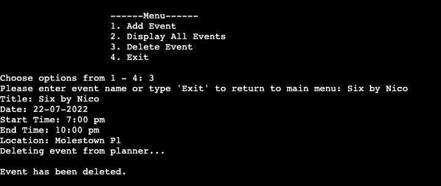
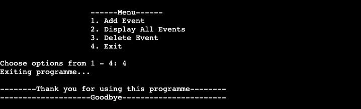

# Event Planner
This programme is an Event planner that allows users to input key events they have coming up. The planner allows them to input the name of the event, the date, start and end times, location and brief description. The programme also allows them the display all their inputted events to get a look at what's upcoming at a glance and delete an event.

## UX Design
### User Stories
As a user, I want:
* The programme to be simple to use and understand
* The programme to have clear instructions
* A programme with a simple menu
* A programme with good feedback on my inputs and processing of my information
* To be able to easily add my events
* To be able to view all my events at a glance and delete events

### Site Owner Goals
As the owner of this programme, my goals are to:
* Create a programme that is easy to use and navigate
* Create a programme with clear instructions for the user
* Create a programme that can add events, 
* Create a programme that can delete events 
* Create a programme that can display all events
* Create a programme that interacts with Google Sheets

## Structure
### Flowchart 

Link - https://app.diagrams.net/ 

## Features
### Existing Features
#### Main Menu
The main menu opens up with a welcome message that says "Welcome to your Digital Planner". The menu gives the user 4 options to choose from. They are asked to choose options from 1 - 4, inputting the number of the option, they want to proceed with.

#### Add Event
This menu option allows the user to add their event, adding the event title, date, start time, end time and location. Once they input the details and the different sections of their details are validated with the correct input data the event is added to the google spreadsheet. 

#### Display All Events
This menu option allows the user to display all the events stored in the database. 

#### Delete Event
This menu option allows the user to delete an event from the database by asking them to input the title of the event and then deleting the corresponding event details.

#### Exit
This menu option allows the user to exit from the programme, displaying a goodbye message goodbye.

### Future Features
* Allow users to edit events they have already added to the database, amending their details.

## Testing
I passed the code through [PEP8](http://pep8online.com/) and the result showed all rght with no issues.

### Bugs
#### AttributeError: ‘dict’ object has no attribute ‘append’
The main issue that kept occurring here was that the add event function would not run. This was because dictionaries in Python do not provide an append option. To resolve this, I had to use a list instead of a dictionary, changing '{ }' to '[ ]'.

#### TypeError: Object of type function is not JSON serializable
The main issue here was that the excel sheet wouldn't update with the newly added event. This was because I was calling the wrong arguments into the functions for adding events and updating the events worksheet. To resolve this I changed the arguments within the respective functions. 
* update_events_worksheet(event_details)
* Def update_events_worksheet(event) 
* events_worksheet.append_row(event)

#### AttributeError: 'list' object has no attribute 'items'
The main issue here was that the events within the database would not display when the function was called. This was because I was using the wrong code to "get all values" instead of "get all records". To resolve this I rewrote the code to get all records.  

## Deployment
I deployed this project in Heroku using the following steps:
1. Log In to Heroku
2. From the Heroku dashboard, click on "New" and in the drop-down click "Create new app"
3. Create a unique name for the project, select your region and click "Create app"
4. Navigate to the Settings tab
5. Scroll down to config var and click on "Reveal Config Vars"
   - In the field for KEY enter CREDS 
   - In the field for VALUE paste in all the content from the creds.json file. 
   - Click "Add"
6. Using the code institute template, you must add another config var
   - In the field for KEY enter PORT
   - In the field for VALUE enter 8000
7. Scroll down to buildpacks and click on "Add buildpack"
   - Select python and click "Save changes"
   - Select nodejs and click "Save changes"
   - Make sure python is on top and nodejs underneath
8. Navigate to the Deploy tab at the top of the page
9. Go to deployment method and select "GitHub"
10. Confirm you want to connect to GitHub by clicking "Connect to GitHub"
    - Insert repository name and click "Search"
    - Click "Connect" to link up Heroku app to the GitHub repository code
11. Scroll down and choose a deployment method 
    - Click "Enable Automatic Deploys" 
    - This allows Heroku to rebuild your app every time you push a new change to your code to GitHub
12. Click "View" to go to the deployed link

## Technologies Used
* Python

## Credits
* Creating a menu - [Stack Overflow](https://stackoverflow.com/questions/19964603/creating-a-menu-in-python)
* Validating a date string format - [Stack Overflow](https://stackoverflow.com/questions/16870663/how-do-i-validate-a-date-string-format-in-python)
* Validating time strings - [Datatest - Read the Docs](https://datatest.readthedocs.io/en/stable/how-to/date-time-str.html)
* Append values - [Stack Overflow](https://stackoverflow.com/questions/48234473/python-attributeerror-dict-object-has-no-attribute-append)

## Support
* Richard Wells Code Institute Mentor.