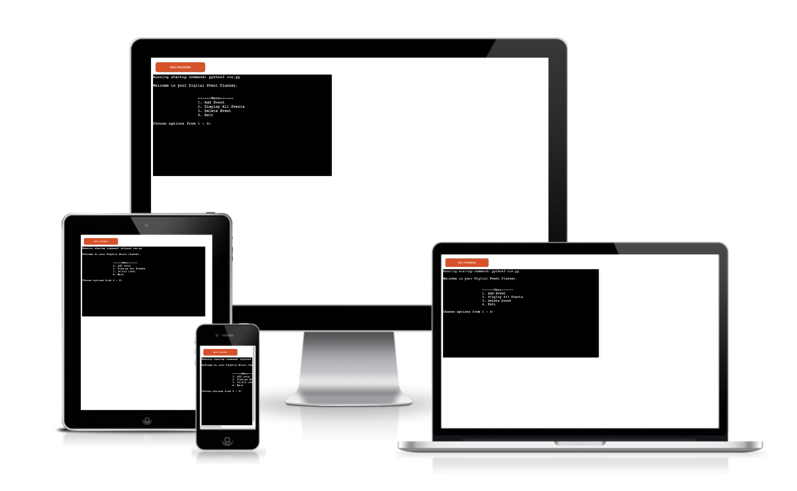
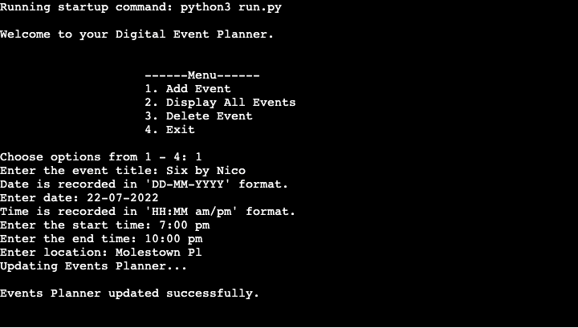
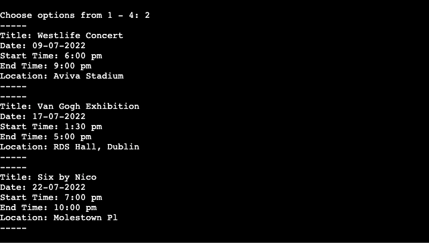

# Event Planner
This programme is an Event planner that allows users to input key events they have coming up. The planner allows them to input the name of the event, the date, start and end times, location and brief description. The programme also allows them the display all their inputted events to get a look at what's upcoming at a glance and delete an event.

## UX Design
### User Stories
As a user, I want:
* The programme to be simple to use and understand
* The programme to have clear instructions
* A programme with a simple menu
* A programme with good feedback on my inputs and processing of my information
* To be able to easily add my events
* To be able to view all my events at a glance and delete events

### Site Owner Goals
As the owner of this programme, my goals are to:
* Create a programme that is easy to use and navigate
* Create a programme with clear instructions for the user
* Create a programme that can add events 
* Create a programme that can display all events
* Create a programme that can delete events 
* Create a programme that interacts with Google Sheets

## Structure
### Flowchart 

## Features
### Existing Features
#### Main Menu
The main menu opens up with a welcome message that says "Welcome to your Digital Planner". The menu gives the user 4 options to choose from. They are asked to choose options from 1 - 4, inputting the number of the option, they want to proceed with.

#### Add Event
This menu option allows the user to add their event, adding the event title, date, start time, end time and location. Once they input the details and the different sections of their details are validated with the correct input data the event is added to the google spreadsheet. 

#### Display All Events
This menu option allows the user to display all the events stored in the database. 

#### Delete Event
This menu option allows the user to delete an event from the database by asking them to input the title of the event and then deleting the corresponding event details.

#### Exit
This menu option allows the user to exit from the programme, displaying a goodbye message goodbye.

### Future Features
* Allow users to edit events they have already added to the database, amending their details.

## Testing
### Easy to navigate and clear instructions
I tested the programme by ensuring it accomplished all the goals I set out for it. I tested the programme at each stage ensuring it was easy to use and navigate and ensuring it provided clear instructions for the user. I tested the navigation menu by working through each of the options it gave. Each option gave me a corresponding instruction, that allowed me to know the exact type of input that was required. I accounted for the event where the user might input the wrong type of information. I tested this by inputting the wrong information, as I made my way through the programme and was provided with error messages, stating the reason why the error had occurred and the type of information required. This gave me a chance to input the data again.
### Successfully add events
I went through the add event menu option, which asked me to add the event title, date, times and location. I tested this area by inputting incorrect information and seeing what feedback I got on my inputs. When I put no input for the event title an error message popped up saying "Empty string, please input data". Then I got a chance to input the event title again. The next input requirement was the event date. This input had a clear set of instructions stating the format in which the date is recorded, "DD-MM-YY". When I put in a date that was in the past, it gave me an error message saying "Error: Date is earlier than the current date. Input date again". This then allowed me to input the date again. The next input was the start time and end time. This input gave clear instructions stating the format in which the time is recorded, HH:MM am/pm. When I input the wrong time format, it gave an error message saying "Incorrect time format. Should be 12-hour time (e.g. 2:00 pm)". When I put in the correct time format but put in a start time that was later than the end time I got another error message saying "Error: Start time is later than your end time. Input start and end time again". The last input was the location and just like the event title, when I left this part blank I received an error message saying "Empty string, please input data". When all the input options were filled, it gave me a feedback message saying "Updating Events Planner..." and then another feedback message saying "Events Planner updated successfully".

### Successfully display all events
I tested the display all events option by going through it and seeing if all the events were displayed correctly. When this option was selected all the events displayed in the terminal.

### Successfully delete events
I went through the delete event option and it gave me clear instructions to input the name of the event I wanted to delete but also gave me another option to type 'Exit' into the terminal if I wanted to return to the main menu. I first tested if it would successfully delete an event by typing in the name of the event I wanted to be deleted and it gave me feedback, saying "Deleting event from planner..." and then another feedback message saying "Event has been deleted". To check this, I selected the display all events option from the main menu, and the event I deleted was no longer there. I went back into the delete event option to test if I could go back to the main menu from there and when I typed "Exit" into the terminal, it brought me back to the main menu.

### Interact with Google Sheets
I tested the programme's successful interaction with Google sheet by seeing if the sheet updated when a new event was added which it did and seeing if an event would delete from it when that option was chosen in the terminal which it did.

### PEP8
I passed the code through [PEP8](http://pep8online.com/) and the result showed all right with no issues.

### Bugs
#### AttributeError: ‘dict’ object has no attribute ‘append’
The main issue that kept occurring here was that the add event function would not run. This was because dictionaries in Python do not provide an append option. To resolve this, I had to use a list instead of a dictionary, changing '{ }' to '[ ]'.

#### TypeError: Object of type function is not JSON serializable
The main issue here was that the excel sheet wouldn't update with the newly added event. This was because I was calling the wrong arguments into the functions for adding events and updating the events worksheet. To resolve this I changed the arguments within the respective functions. 
* update_events_worksheet(event_details)
* Def update_events_worksheet(event) 
* events_worksheet.append_row(event)

#### AttributeError: 'list' object has no attribute 'items'
The main issue here was that the events within the database would not display when the function was called. This was because I was using the wrong code to "get all values" instead of "get all records". To resolve this I rewrote the code to get all records.  

## Deployment
The live deployment can be found using the following URL - https://events-planner-p3.herokuapp.com/

I deployed this project in Heroku using the following steps:
1. Log In to Heroku
2. From the Heroku dashboard, click on "New" and in the drop-down click "Create new app"
3. Create a unique name for the project, select your region and click "Create app"
4. Navigate to the Settings tab
5. Scroll down to config var and click on "Reveal Config Vars"
   - In the field for KEY enter CREDS 
   - In the field for VALUE paste in all the content from the creds.json file. 
   - Click "Add"
6. Using the code institute template, you must add another config var
   - In the field for KEY enter PORT
   - In the field for VALUE enter 8000
7. Scroll down to buildpacks and click on "Add buildpack"
   - Select python and click "Save changes"
   - Select nodejs and click "Save changes"
   - Make sure python is on top and nodejs underneath
8. Navigate to the Deploy tab at the top of the page
9. Go to deployment method and select "GitHub"
10. Confirm you want to connect to GitHub by clicking "Connect to GitHub"
    - Insert repository name and click "Search"
    - Click "Connect" to link up Heroku app to the GitHub repository code
11. Scroll down and choose a deployment method 
    - In manual deploy click "Deply Branch"
    - Then click on "Enable Automatic Deploys" 
      - This allows Heroku to rebuild your app every time you push a new change to your code to GitHub

## Technologies Used
* Python

## Credits
* Creating a menu - [Stack Overflow](https://stackoverflow.com/questions/19964603/creating-a-menu-in-python)
* Validating a date string format - [Stack Overflow](https://stackoverflow.com/questions/16870663/how-do-i-validate-a-date-string-format-in-python)
* Validating time strings - [Datatest - Read the Docs](https://datatest.readthedocs.io/en/stable/how-to/date-time-str.html)
* Append values - [Stack Overflow](https://stackoverflow.com/questions/48234473/python-attributeerror-dict-object-has-no-attribute-append)

## Support
* Richard Wells Code Institute Mentor.